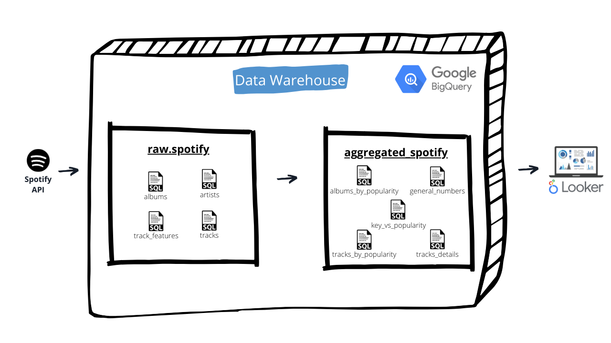
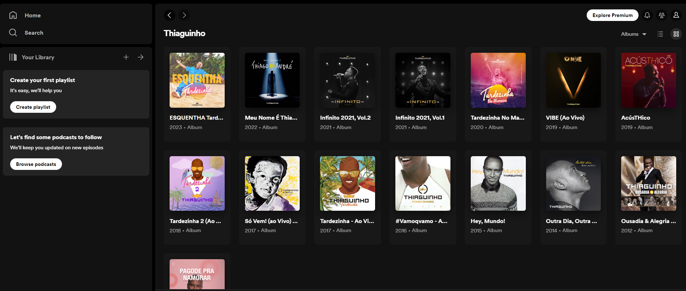
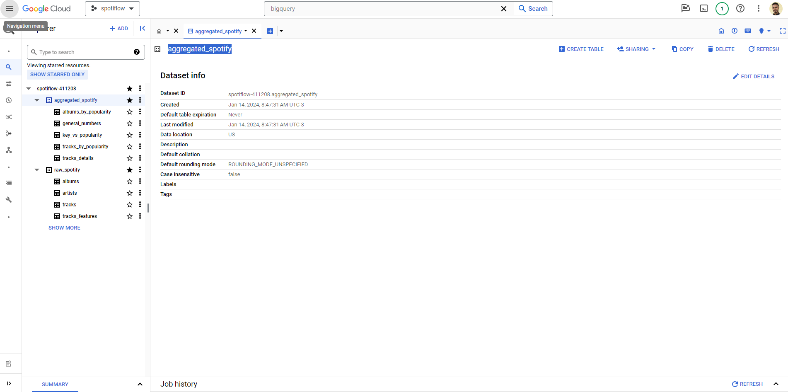
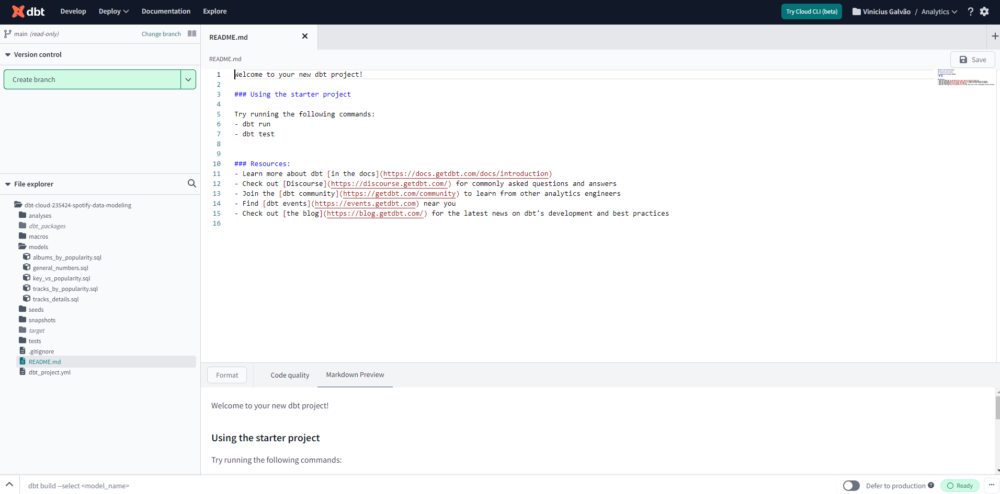
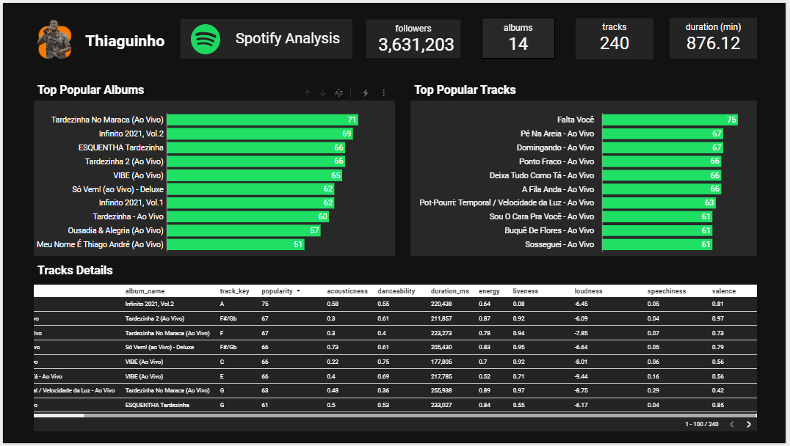

# Thiaguinho Spotify Data Analysis | Datawarehouse with BigQuery

## Overview
This project focuses on the comprehensive analysis of music data sourced from the Spotify API, employing robust data engineering, transformation, and analytics processes. The end goal is to extract meaningful insights from the musical catalog, specifically exploring the discography of the artist Thiaguinho.

## Workflow

- **Data Collection**: Utilizing the Spotify API, the project gathers data on 14 albums by Thiaguinho, resulting in the analysis of 240 songs.

- **Storage**: The collected data is efficiently stored in Google BigQuery, providing a scalable and performant platform for analytics.

- **Transformation and Aggregation**: Leveraging dbt (data build tool), the project applies transformative processes and aggregations on the BigQuery data. These transformations enhance the data for further analytical exploration.

- **[Dashboard](https://lookerstudio.google.com/reporting/2b216e5d-85a1-4a0a-bd98-d2d5c3f24141)**: Looker is employed to create a visually insightful dashboard. The dashboard aggregates key metrics, providing an overview of Thiaguinho's musical portfolio.

## Insights

A total of `240 songs` from Thiaguinho's `14 albums` were analyzed, summing up to `876 minutes` of music.
Popularity metrics were examined to identify the most popular albums and songs on Spotify.

Detailed characteristics of the songs, including `acousticness, danceability, energy, liveness, loudness, speechiness, and valence`, were collected and analyzed.

# Impact
This project offers a nuanced understanding of Thiaguinho's musical collection, shedding light on the popularity of albums and individual tracks. The insights gained contribute not only to music enthusiasts but also to data professionals keen on exploring the intersection of data engineering and analytics in the realm of music.

# Technologies Used:

- Spotify API
- Google BigQuery
- Python
- dbt (data build tool)
- Looker

# How to Use

- **Data Collection**: Run the Spotify API data collection script.
- **Transformation**: Execute dbt modelsfor data transformations and aggregations.
- **Analytics**: Explore insights on the Looker dashboard.
